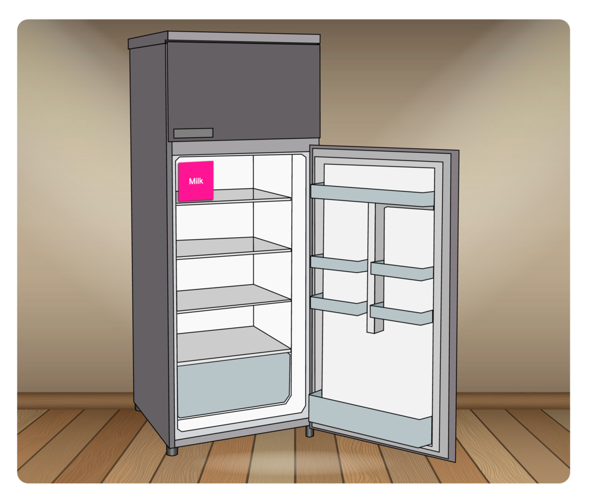

# Fill the Fridge

The fridge is looking kinda sparse—fill it with tasty and healthy foods!

## Task

Write a function that takes an array of strings (food items)
and adds them to the fridge.

### Requirements

- You will need to find the fridge using methods provided on the `document`
- You'll need to iterate over the food items with a loop or array method—the choice is yours!
- You'll need to add a class of `fridge__item` to the food so it displays properly (as a pink box)
- Don't forget to run the function

#### Bonus

Add both food items to the fridge by combining both food arrays (and calling the function only once!)

